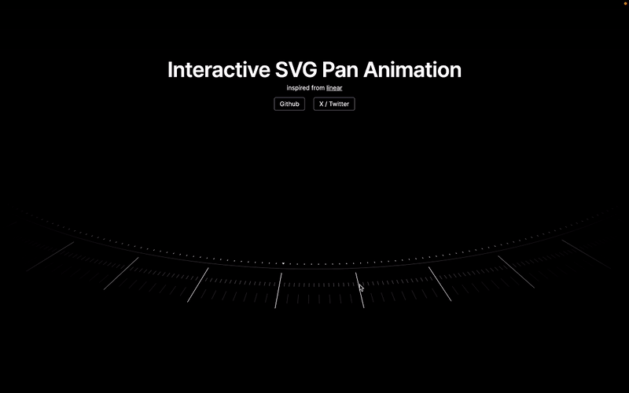

# Interactive SVG Pan Animation

> [!NOTE]
> This demo was inspired from [Linear](https://linear.app/plan). I wanted to create a similar effect using SVG and Framer Motion.

**Live link**: [svg-pan-animation.vercel.app](https://svg-pan-animation.vercel.app)

[](https://svg-pan-animation.vercel.app/)

## Tech

- Next.js
- Framer Motion

## How it works

- make a container div
- render the svg
- transform the container div: `rotateX(someDeg)`
- transform the svg to your needs
- add `motion` to the svg
- add `onPan` event listener to the svg
- update the svg's `rotateZ` value accordingly
- and tada!! 🎉

## Get started

> [!IMPORTANT]
> You can use any package manager you like. I'm using `bun` here.

```bash
# clone the repo
git clone https://github.com/rudrodip/svg-pan-animation.git
cd svg-pan-animation

# install dependencies
bun install

# run the dev server
bun run dev
```

## License

This project is licensed under the MIT License - see the [LICENSE](./LICENSE.md) file for details.
